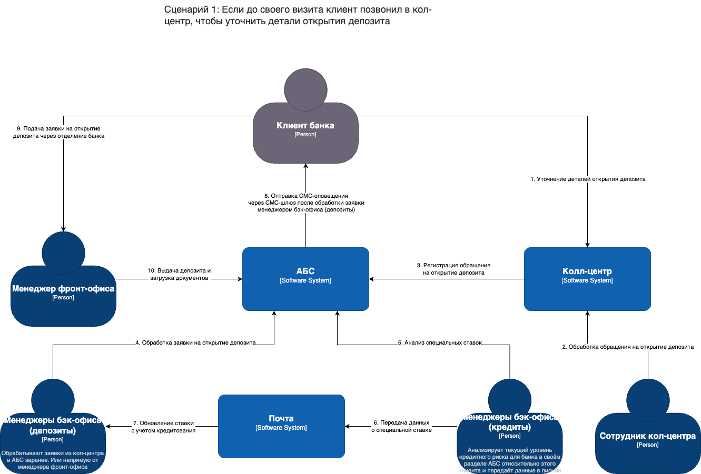
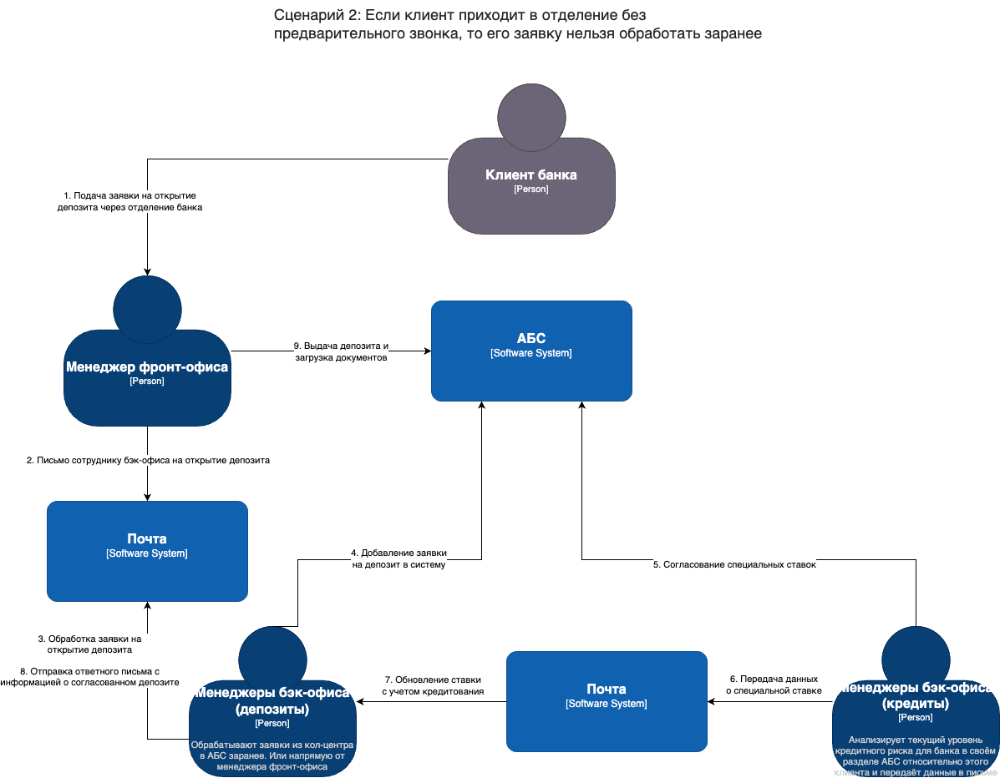

# Текущее состояние IT-ландшафта и сценарии открытия депозита

- [Текущее состояние IT-ландшафта и сценарии открытия депозита](#текущее-состояние-it-ландшафта-и-сценарии-открытия-депозита)
  - [1. Карта IT-ландшафта](#1-карта-it-ландшафта)
  - [2. Сценарии открытия депозита](#2-сценарии-открытия-депозита)
    - [Сценарий 1: Клиент звонит в кол-центр заранее](#сценарий-1-клиент-звонит-в-кол-центр-заранее)
    - [Сценарий 2: Клиент приходит в отделение без звонка](#сценарий-2-клиент-приходит-в-отделение-без-звонка)
  - [Ключевые моменты](#ключевые-моменты)

## 1. Карта IT-ландшафта
- **Основные бизнес-возможности** банка: 
  1. Продажи в сети отделений  
  2. Продажи через кол-центр  
  3. Digital-оповещения клиентов  
  4. Обслуживание депозитных процессов  
  5. Обслуживание кредитных процессов  
  6. Управление договорами  
- **Подразделения** (фронт-офис, бэк-офис по кредитам и депозитам, кол-центр, партнёрский кол-центр) по строкам
- **Ключевые IT-системы**, используемые каждым подразделением в рамках каждой бизнес-возможности:
  - АБС (учёт операций, бухгалтерия)
  - Система кол-центра
  - Система партнёрского кол-центра
  - Почта (для передачи Excel-файлов, коммуникаций между бэк-офисами)

> В таблице показано, какая система нужна конкретному подразделению для реализации определённой возможности. Например, «Фронт-офис» для «Продаж в сети отделений» использует **АБС** и **Почту**, а "Кол-центр" для "Продаж через кол-центр" — **Систему кол-центра**

## 2. Сценарии открытия депозита

### Сценарий 1: Клиент звонит в кол-центр заранее
1. **Клиент** уточняет детали вклада по телефону
2. **Сотрудник кол-центра** регистрирует обращение в **Системе кол-центра**, которое затем передаётся в **АБС**
3. **Менеджеры бэк-офиса (депозиты)** видят заявку в **АБС** и рассчитывают ставку. При необходимости запрос по «спецставке» согласуется с **кредитным бэк-офисом** (данные передаются по **Почте**)
4. Итоговая ставка фиксируется в **АБС**; автоматически формируется **СМС** для клиента
5. **Клиент** приходит в отделение, **Фронт-офис** оформляет депозит (через **АБС**) и выдаёт документы

### Сценарий 2: Клиент приходит в отделение без звонка
1. **Клиент** подаёт заявку прямо в офисе
2. **Фронт-офис** пишет письмо в **бэк-офис (депозиты)** (через **Почту**), чтобы запросить или рассчитать ставку
3. **Менеджеры бэк-офиса (депозиты)** оформляют заявку в **АБС**; если нужна «спецставка», делают запрос в **бэк-офис (кредиты)** (обмен данными по **Почте**)
4. После согласования ставки **бэк-офис (депозиты)** присылает её обратно **Фронт-офису**
5. **Фронт-офис** создает вклад в **АБС**, выдаёт клиенту документы и загружает подписанные документы обратно в систему

> В обоих сценариях **АБС** является центральной системой учёта и формирования договоров, а бэк-офис депозитов и кредитов обмениваются деталями по **Почте**, в частности Excel-файлами со ставками и информацией о рисках

## Ключевые моменты
1. АБС — главная учётная система (операции, договоры)
2. Система кол-центра — принимает входящие/исходящие звонки и передаёт заявки в АБС
3. Почта — используется для согласования «специальных ставок» и обмена Excel-файлами между бэк-офисами (депозиты / кредиты)
4. Система партнёрского кол-центра — внешняя система, используется для аутсорсинговых звонков (пока не задействована в открытии депозитов, но фигурирует в карте IT-ландшафта)